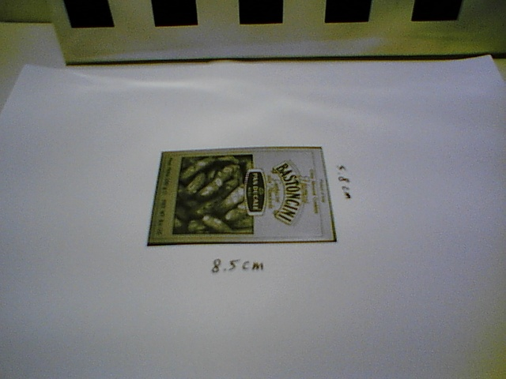
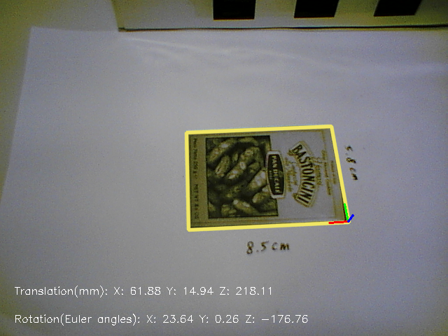
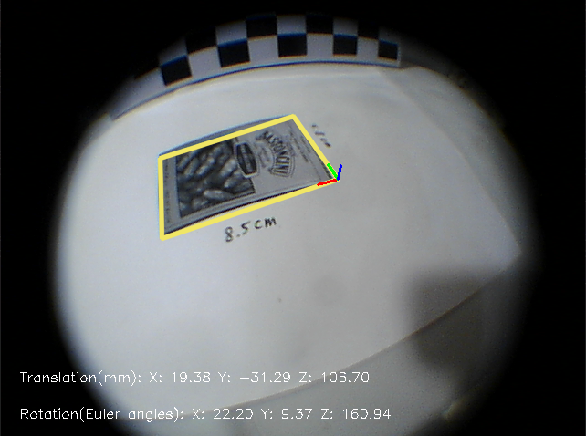

# An example of estimating camera pose from homography
This code is an example to demo camera pose estimation via homography.
To run this example, you need to prepare a planar target, change the settings in the code, and provide a calibration.yaml file containing camera intrinsic parameters.

